# lwc-practice-scenario

This project was inspired by [lwc-practice-scenario](https://salesforcediaries.com/category/lwc-practice-scenarios/)

## Scenario Solutions

[LWC EXCHANGE – SCENARIO 9](https://salesforcediaries.com/2023/04/21/lwc-exchange-scenario-9/)

- Source code: [accountCreation](https://github.com/dyncan/lwc-scenarios/tree/main/force-app/main/default/lwc/accountCreation)

	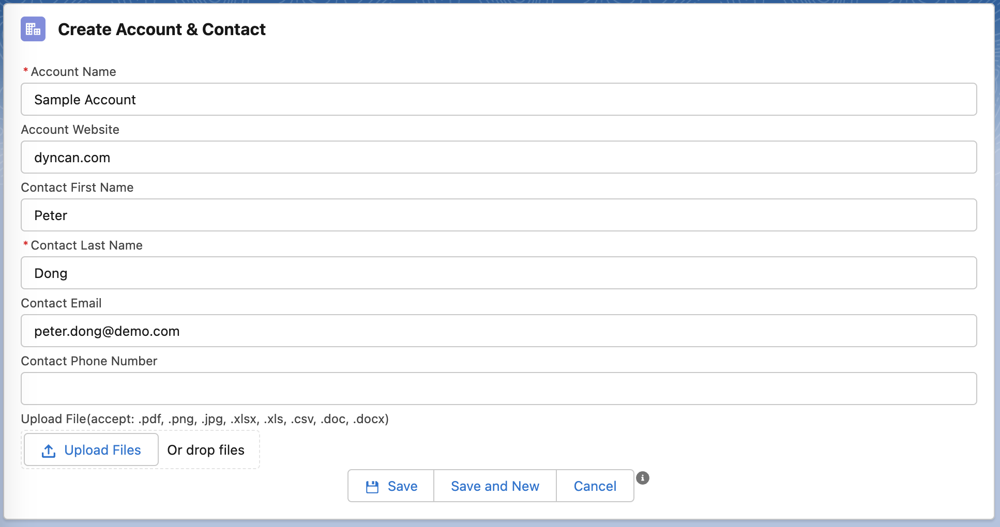
	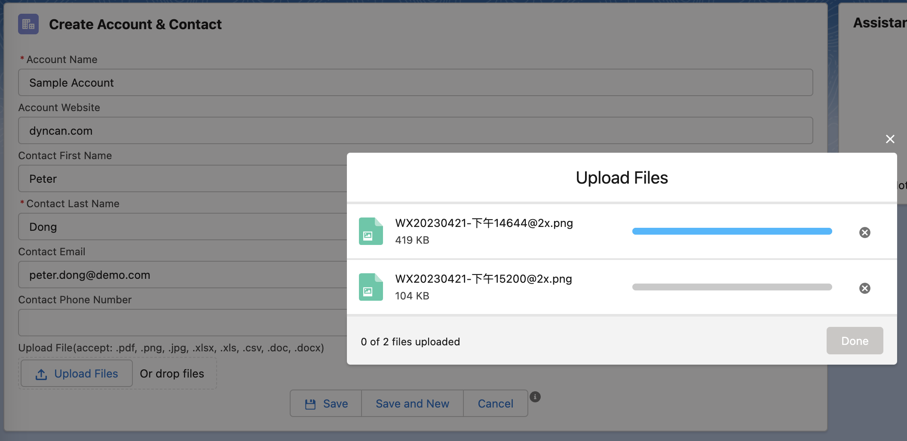
	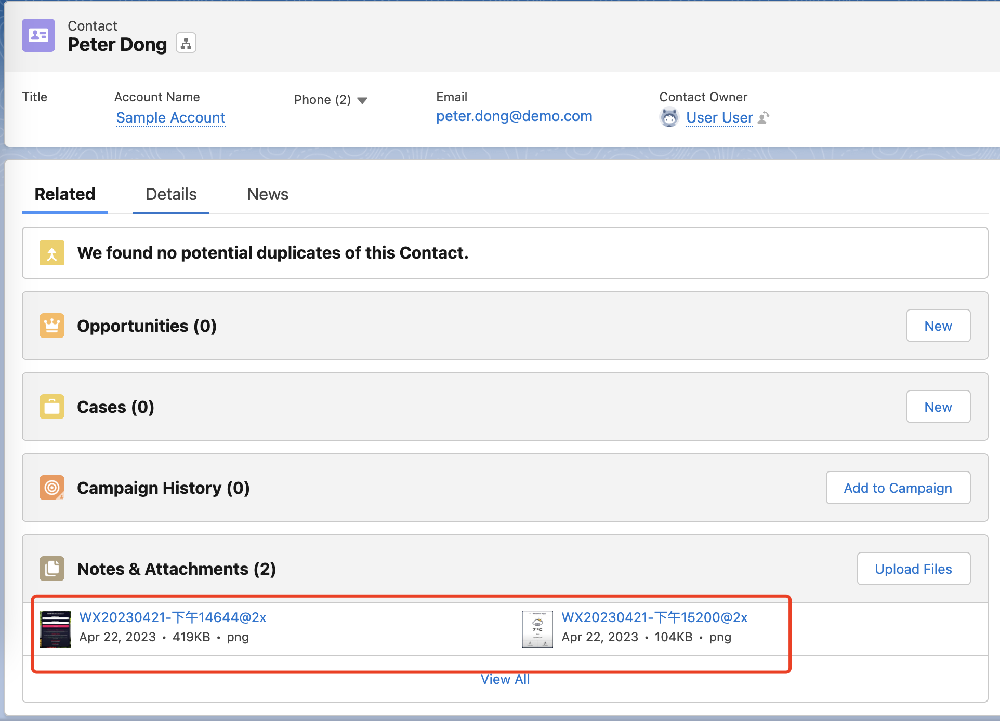

[LWC EXCHANGE – SCENARIO 8](https://salesforcediaries.com/2023/04/16/lwc-exchange-scenario-8/)

- Source code: [publicApiCallout](https://github.com/dyncan/lwc-scenarios/tree/main/force-app/main/default/lwc/publicApiCallout)

	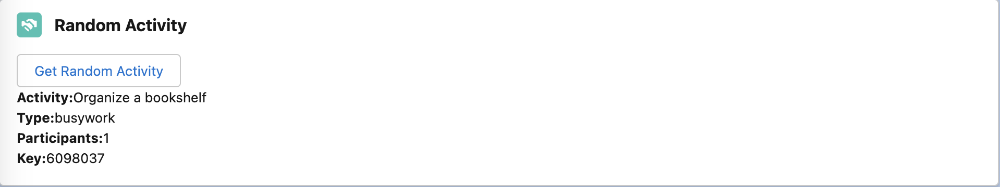

---

[LWC EXCHANGE – SCENARIO 7](https://salesforcediaries.com/2022/10/21/lwc-exchange-scenario-7/)

- Source code: [dataFiller](https://github.com/dyncan/lwc-scenarios/tree/main/force-app/main/default/lwc/dataFiller)
- Source code: [personTable](https://github.com/dyncan/lwc-scenarios/tree/main/force-app/main/default/lwc/personTable)

	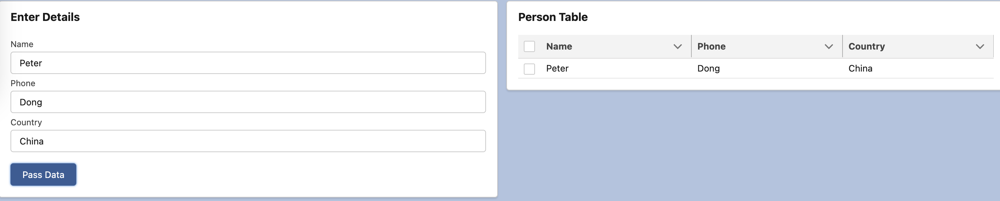

---
[LWC EXCHANGE – SCENARIO 6](https://salesforcediaries.com/2022/10/01/lwc-exchange-scenario-6/)

- Source code: [transactionForm](https://github.com/dyncan/lwc-scenarios/tree/main/force-app/main/default/lwc/transactionForm)

	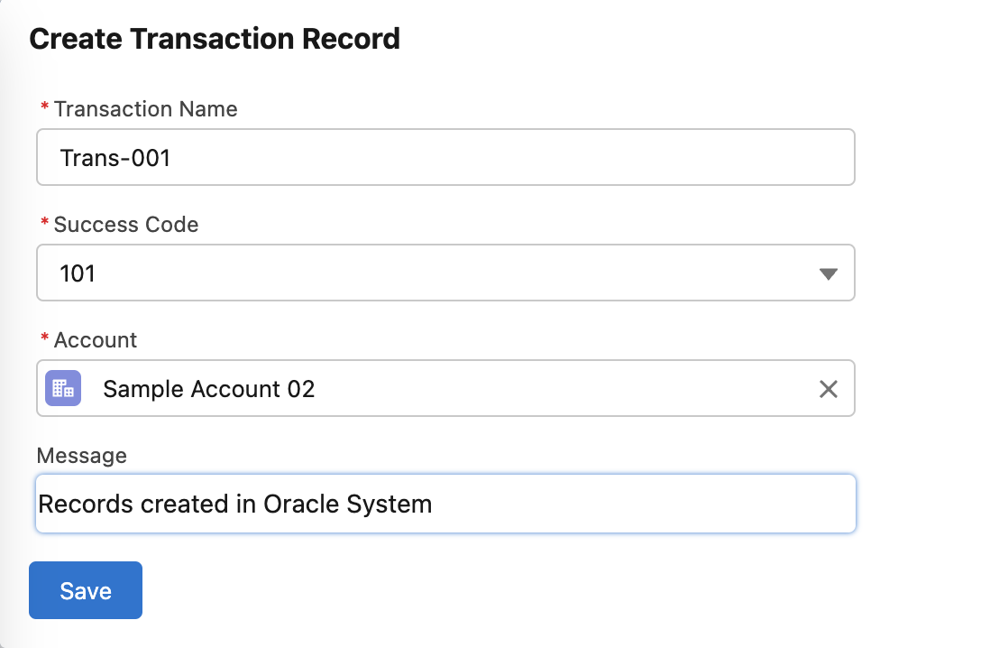
	

---

[LWC EXCHANGE – SCENARIO 4](https://salesforcediaries.com/2022/09/20/lwc-exchange-scenario-4/)

- Source code: [distanceCalculator](https://github.com/dyncan/lwc-scenarios/tree/main/force-app/main/default/lwc/distanceCalculator)

	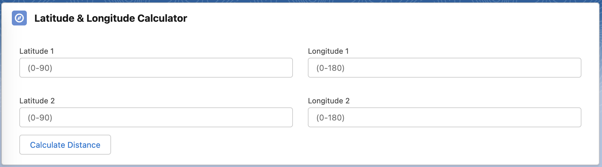
	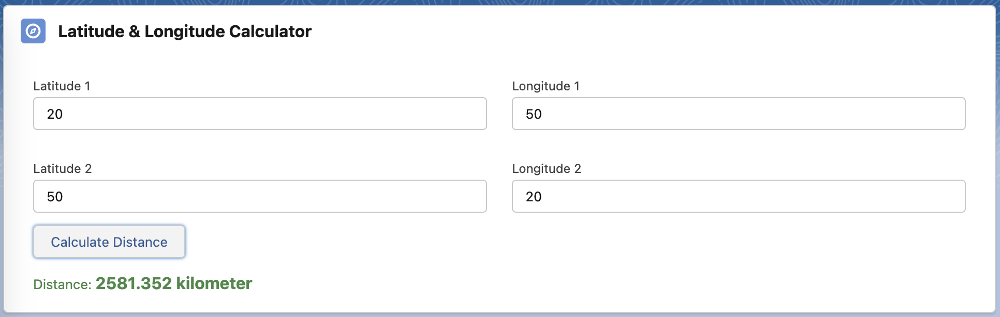

---

[LWC EXCHANGE – SCENARIO 3](https://salesforcediaries.com/2022/09/17/lwc-exchange-scenario-3/)

- Source code: [parent](https://github.com/dyncan/lwc-scenarios/tree/main/force-app/main/default/lwc/parent)
- Source code: [child](https://github.com/dyncan/lwc-scenarios/tree/main/force-app/main/default/lwc/child)
  

	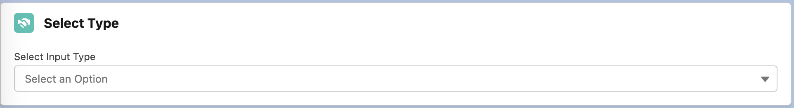
	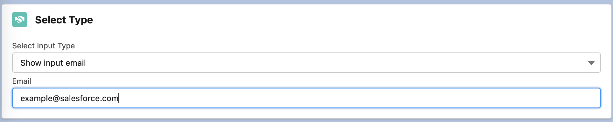

---

[LWC EXCHANGE – SCENARIO 2](https://salesforcediaries.com/2022/09/17/lwc-exchange-scenario-2/)

- Source code: [calculator](https://github.com/dyncan/lwc-scenarios/tree/main/force-app/main/default/lwc/calculator)

	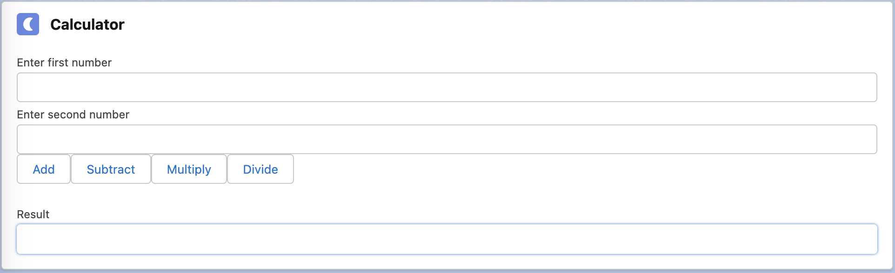
	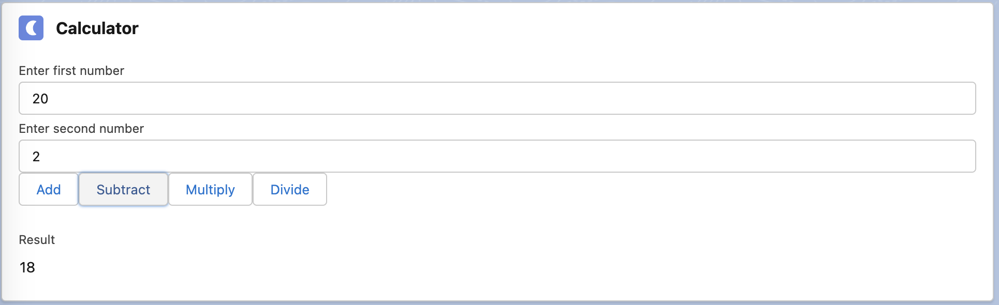

---

[LWC EXCHANGE – SCENARIO 1](https://salesforcediaries.com/2022/09/17/lwc-exchange-scenario-1/)

- Source code: [approvalProcessViewer](https://github.com/dyncan/lwc-scenarios/tree/main/force-app/main/default/lwc/approvalProcessViewer)

	
	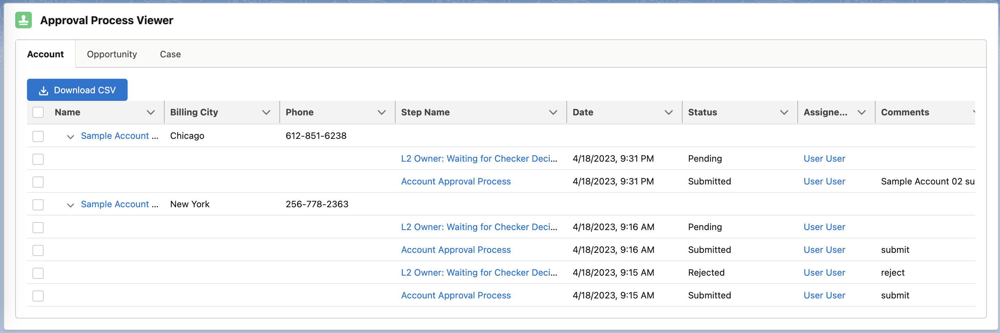
    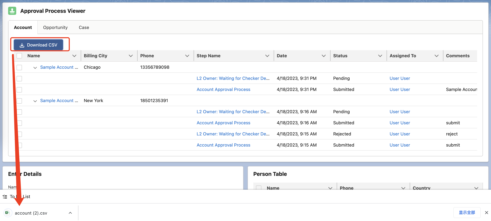

## Installation

1. Run `chmod +x ./install-dev.sh` to set the execute permission.

2. Run `./install-dev.sh YOUR_SCRATCH_ORG_ALIAS` to create a scratch org and push the source code to org.

3. After the bash script is executed, it will automatically open the scratch org.

4. Add lwc components to home page.